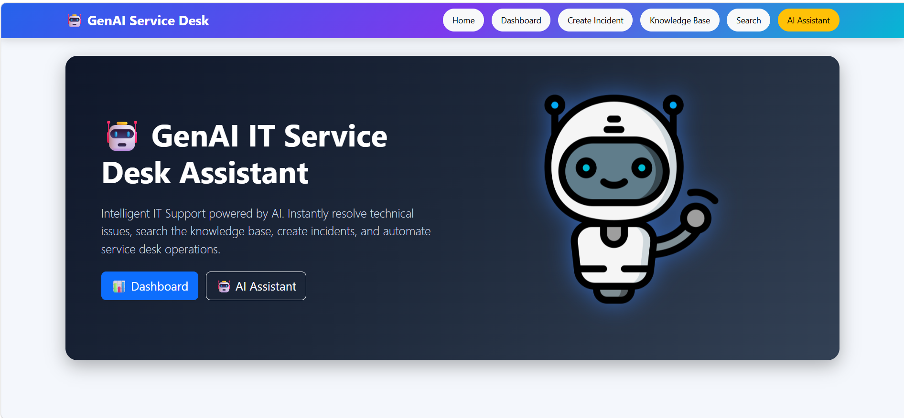
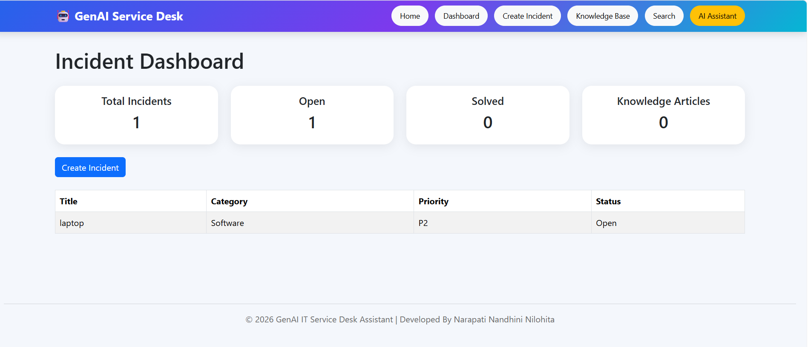
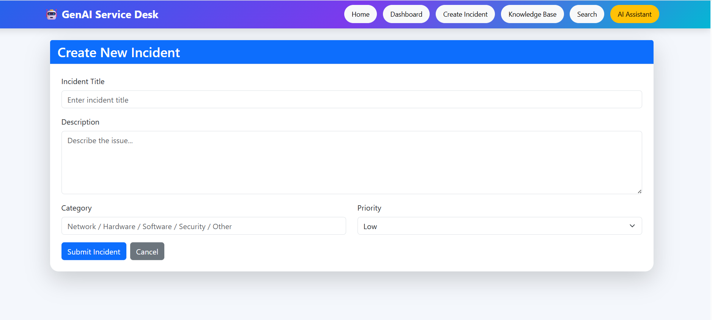
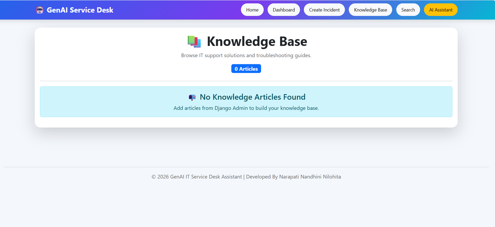
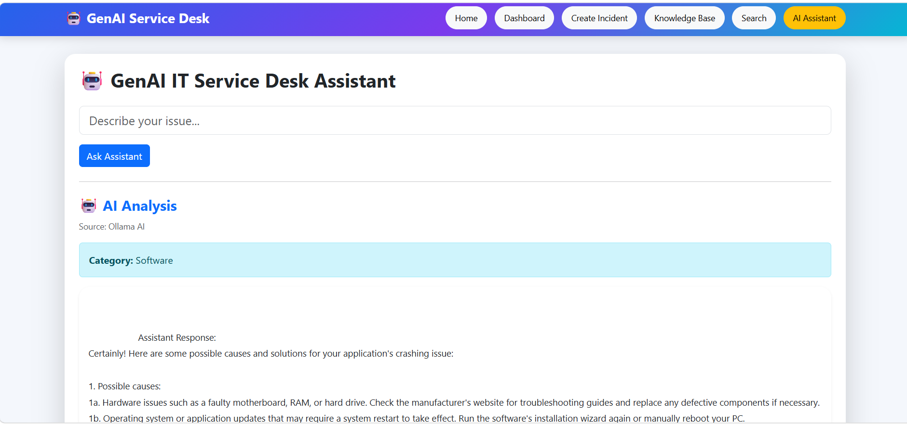
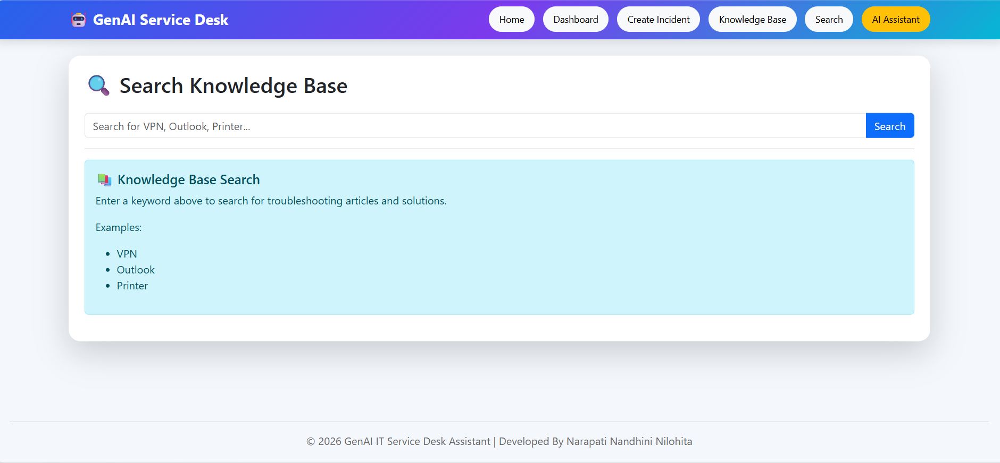

# 🤖 GenAI IT Service Desk Assistant

An AI-powered IT support application built using **Django, Python, and Ollama (Local LLM)**.

The system helps users report technical issues, automatically analyzes problems, classifies incidents into categories such as **Hardware, Software, Network, Account, and Security**, and generates troubleshooting solutions.

It provides an interactive web-based interface where users can describe their issues and receive **AI-generated support responses** without relying on external APIs.

The project integrates **Generative AI with IT Service Management concepts** to automate incident handling, improve response time, and enhance user support experience.

---

# 🚀 Application Preview

## 🏠 Home Page

The home page provides quick access to dashboard, incident creation, knowledge base, search, and AI assistant features.

---

# ✨ Features

✅ AI-based issue analysis and troubleshooting  
✅ Automatic incident categorization  
✅ Local LLM integration using Ollama  
✅ Django-based web interface  
✅ Knowledge base and incident management support  
✅ Secure local AI processing  

---

# 📸 Screenshots

## 📊 Dashboard

---

## 🎫 Create Incident

---

## 📚 Knowledge Base

---

## 🤖 AI Assistant

---

## 🔎 Search

---

# 🛠️ Tech Stack

| Technology | Usage |
|---|---|
| Python | Backend Development |
| Django | Web Framework |
| Ollama | Local LLM Integration |
| TinyLlama | Generative AI Model |
| SQLite | Database |
| HTML | Frontend |
| CSS | Styling |
| Bootstrap | UI Design |
| Generative AI | Intelligent Support |

---

# 📂 Project Structure
